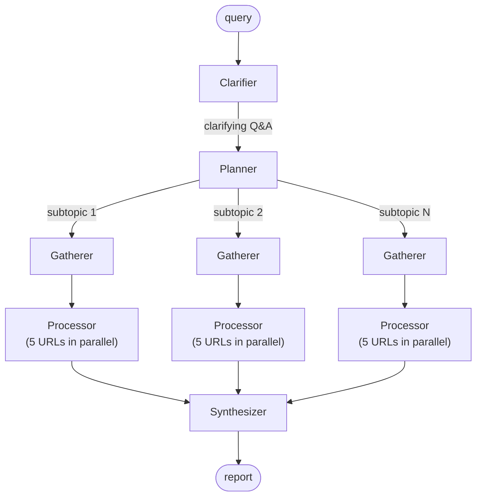
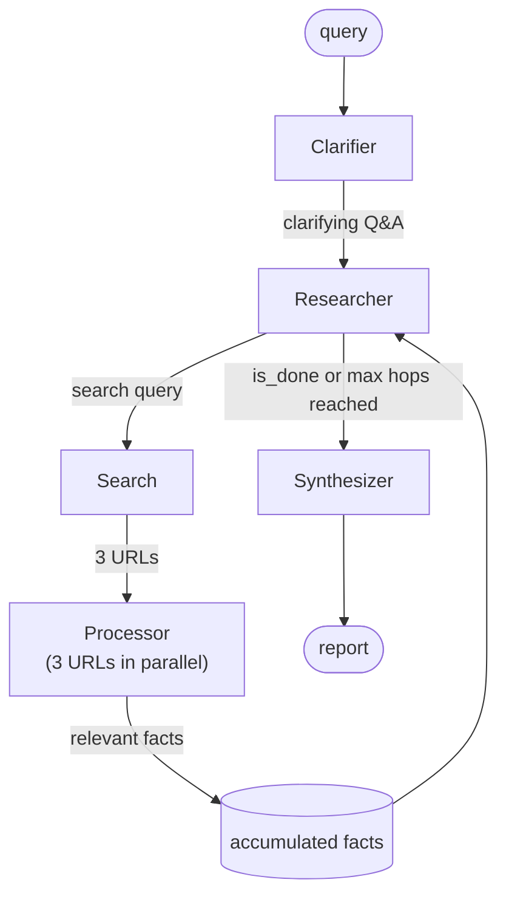

<h1 align="center">deep research</h1>

<p align="center">
An attempt to implement deep research using DSPy - and in the process, learn about evals, prompt optimization, and how these systems actually work under the hood.
</p>

---

## What this is

Basically a research agent that you give a query, it asks some clarifying questions, breaks it into subtopics, searches the web, reads pages, and writes a report with citations. but the main point isn't really just building something that works - it's going through the whole loop of building, evaluating, and actually optimizing an LLM pipeline using DSPy and learning stuff along the way.

Inspired by this [blog post](https://www.cmpnd.ai/blog/learn-dspy-deep-research.html) which walks through building a deep research agent with DSPy.

## Architecture

### Baseline

The first implementation was a fixed pipeline - plan everything upfront, execute linearly.



### Multi-hop

The current implementation replaces the rigid plan-then-gather approach with a dynamic loop. instead of planning upfront, the agent decides what to search for next based on what it already knows.



this feels more natural to me - the agent adapts its search strategy based on what it already knows, rather than committing to a fixed plan upfront.

One thing worth mentioning is the Processor uses `dspy.RLM` - RLM stands for Retrieve-Language Model. The intuition here is that we're passing in the full content of a webpage, which can get really long and blow up the context window. instead of truncating it, it makes more sense to treat the page content as an external store that the LM retrieves from - so the LM only sees the relevant chunks, not the whole thing. that's basically what RLM does.

## Approach

The rough idea:

1. Build a base implementation (baseline) that works end to end
2. Run evals on the baseline
3. Replace with a multi-hop approach and compare
4. Optimize based on eval results using GEPA - haven't touched this yet. a few open questions: not sure which components are worth optimizing, what data to use for the trainset (the pipeline is a loop so intermediate state like accumulated facts isn't saved anywhere), and how to think about end-to-end vs component-level optimization. open to suggestions.
5. Re-run evals and compare

## Evals

Instead of just eyeballing outputs and guessing whether the pipeline is doing well, I want to actually quantitatively measure how the system is performing. The approach is rubric-based evaluation - inspired by [ResearchRubrics: A Benchmark of Prompts and Rubrics For Evaluating Deep Research Agents](https://arxiv.org/abs/2511.07685) (Scale AI, 2025), which was built specifically for evaluating deep research agents. we use their [dataset](https://huggingface.co/datasets/ScaleAI/researchrubrics) directly - the prompts and rubrics are already written, so we just run the pipeline on each prompt and score the output. that said, we only evaluate on a small subset (5 samples) given the limited budget - each run costs API calls for both the pipeline and the judge. the goal here isn't to produce state-of-the-art numbers anyway, it's to go through the full loop of building, evaluating, and optimizing an LLM pipeline and actually understand how these ideas work in practice. also worth noting - i accidentally burned through a decent chunk of credits early on by running experiments with gpt-4o instead of gpt-4o-mini, so had to be conservative with the amount of data used for evals. this is also why the judge model is gpt-4o-mini - ideally you'd want a stronger model than the pipeline itself for evaluation, but given the budget situation that wasn't feasible here.

### How rubric-based evals work

Each research prompt comes paired with a rubric - a list of specific criteria the response should satisfy, each with a weight. The judge LM scores each criterion:

- `1` - satisfied
- `0.5` - partially satisfied
- `0` - not satisfied

The final compliance score is:

```
score = sum(verdict × weight for all criteria) / sum of positive weights
```

Weights reflect importance:
- `[+4, +5]` - critically important, required for a minimally viable response. without this the response is fundamentally flawed.
- `[+2, +3]` - important, a key feature of a strong response but not absolutely essential.
- `+1` - slightly important, a nice-to-have that improves a good response but doesn't significantly change overall quality.
- `-1` - slightly detrimental, a minor issue or stylistic weakness that doesn't impact core quality.
- `[-3, -2]` - detrimental, a significant error that hurts quality or introduces faulty logic.
- `[-5, -4]` - critically detrimental, so severe it makes the response actively harmful or completely invalidates its reasoning.

this is much more meaningful than generic LLM judge questions because the criteria are specific to each prompt. for example, given a prompt like "write a history of Counter-Strike as an esport", a generic judge asking "is this well structured?" tells you very little. but a rubric criterion like "does the response cover the transition from CS 1.6 to CS:GO to CS2?" actually measures whether the report did its job.

### Data

Using a subset of prompts from the ResearchRubrics dataset. the rubrics are already written. running the pipeline on each prompt produces a markdown report, and the evaluator scores it against the rubric automatically.

### What I evaluate

we'll be evaluating the final report generated by the pipeline using this rubric-based approach.

### Running evals

**Step 1: generate clarifications**

since the pipeline asks clarifying questions interactively, we pre-generate answers for each sample using an LLM so evals can run without human input. this only needs to be run once.

```bash
python -m evals.prepare_clarification_qna
```

saves to `evals/clarifications.pkl`.

**Step 2: generate reports**

runs the pipeline on each sample using the pre-generated clarifications.

```bash
python -m evals.generate_reports --name <experiment-name>
```

saves reports to `reports/<experiment-name>/<sample_id>.md`.

**Step 3: score reports**

evaluates each report against its rubric criteria.

```bash
python -m evals.run_evals --name <experiment-name>
```

saves scores to `evals/<experiment-name>_results.csv`.

---

## Results

| sample_id | baseline | multihop | diff |
|-----------|----------|----------|------|
| 6847465956a0f6376a6053c9 | 0.608 | 0.574 | -0.034 |
| 683a58c9a7e7fe4e76958483 | 0.766 | 0.844 | +0.078 |
| 683a58c9a7e7fe4e76958499 | 0.804 | 0.841 | +0.037 |
| 6847465956a0f6376a6053f2 | 0.649 | 0.654 | +0.005 |
| 6847465956a0f6376a605494 | 0.641 | 0.615 | -0.026 |
| **average** | **0.694** | **0.706** | **+0.012** |

mixed results - multihop is slightly better on average (+0.012), with clear wins on the two `683a...` samples but regressions on two of the `68474...` samples. the harder prompts seem to benefit more from dynamic search, while the simpler ones don't consistently improve.

> honestly was expecting more of an improvement from the architectural change. but this is exactly why evals matter - intuitions about what should work better aren't always right, and without a quantitative measure you'd just be guessing. the numbers keep you honest.

## Open questions

**citations** - not sure how to get the model to cite sources accurately without hallucinating. the synthesizer has all the source URLs and facts available, but there's no guarantee the inline citations it produces actually correspond to the right sources. it's unclear whether this is a prompting problem, an architectural one, or something that needs explicit post-hoc verification.

**evaluating citations** - even if we wanted to measure citation quality, it's not obvious how to do it. the rubric-based eval doesn't specifically check whether citations are grounded - it evaluates content coverage. a proper citation eval would need to verify that each inline `[N]` actually traces back to a source that supports the claim, which is a whole separate problem.
