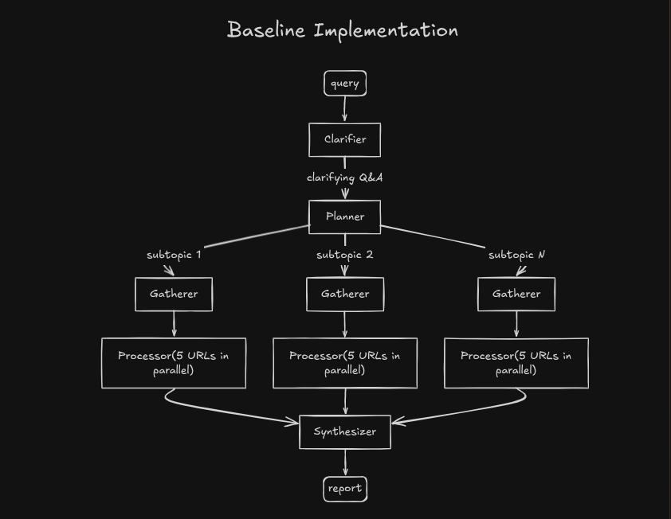
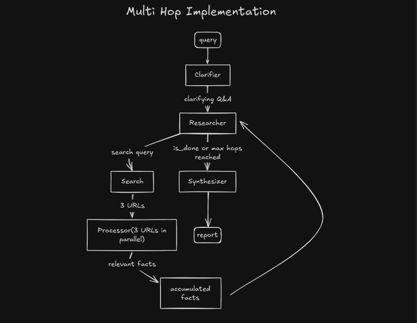
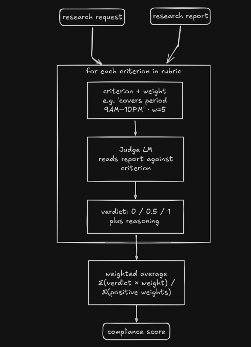

<h1 align="center">deep research</h1>

<p align="center">
An attempt to implement deep research using DSPy - and in the process, learn about evals and the core ideas behind DSPy as a framework.
</p>

---

## What this is

A research agent that you give a query, it asks clarifying questions, then dynamically searches the web across multiple hops - deciding what to look for next based on what it already knows - and writes a report with inline citations. But the main point isn't really just building something that works - it's going through the whole loop of building, evaluating, and actually optimizing an LLM pipeline using DSPy and learning stuff along the way.

Inspired by this [blog post](https://www.cmpnd.ai/blog/learn-dspy-deep-research.html) which walks through building a deep research agent with DSPy.

## Architecture

### Baseline

The first implementation was a fixed pipeline - plan everything upfront, execute linearly.



### Multi-hop

The current implementation replaces the rigid plan-then-gather approach with a dynamic loop. Instead of planning upfront, the agent decides what to search for next based on what it already knows.



This feels more natural to me - the agent adapts its search strategy based on what it already knows, rather than committing to a fixed plan upfront.

One thing worth mentioning is the Processor uses `dspy.RLM` - RLM stands for Retrieve-Language Model. The intuition here is that we're passing in the full content of a webpage, which can get really long and blow up the context window. Instead of truncating it, it makes more sense to treat the page content as an external store that the LM retrieves from - so the LM only sees the relevant chunks, not the whole thing. That's basically what RLM does.

## Approach

The rough idea:

1. Build a base implementation (baseline) that works end to end
2. Run evals on the baseline
3. Replace with a multi-hop approach and compare
4. Optimize based on eval results using GEPA - haven't touched this yet. A few open questions: not sure which components are worth optimizing, what data to use for the trainset (the pipeline is a loop so intermediate state like accumulated facts isn't saved anywhere), and how to think about end-to-end vs component-level optimization. Open to suggestions.
5. Re-run evals and compare

## Evals

Instead of eyeballing outputs, I wanted to quantitatively measure how the pipeline is performing. The approach is rubric-based evaluation, inspired by [ResearchRubrics: A Benchmark of Prompts and Rubrics For Evaluating Deep Research Agents](https://arxiv.org/abs/2511.07685) (Scale AI, 2025).

- **dataset** - using the [ResearchRubrics dataset](https://huggingface.co/datasets/ScaleAI/researchrubrics) directly; the prompts and rubrics are already written, so we just run the pipeline and score the output
- **scale** - only 5 samples due to budget constraints; each run costs API calls for both the pipeline and the judge
- **judge model** - using `gpt-4o-mini`; ideally the judge should be stronger than the pipeline model, but I'd already burned through a lot of credits running failed experiments with `gpt-4o` on the pipeline itself, so didn't want to spend more
- **goal** - to go through the full loop of building, evaluating, and optimizing an LLM pipeline and understand how it works in practice

### How rubric-based evals work

Each research prompt comes paired with a rubric - a list of specific criteria the response should satisfy, each with a weight. The judge LM scores each criterion:

- `1` - satisfied
- `0.5` - partially satisfied
- `0` - not satisfied

The final compliance score is:

```
score = sum(verdict × weight for all criteria) / sum of positive weights
```



Each criterion in the dataset has an associated weight reflecting how much it matters. Positive weights reward meeting the criterion; negative weights are for criteria that describe something the response should *not* do - if satisfied, they penalize the score. The higher the magnitude, the bigger the impact.

### Data

Using a subset of prompts from the ResearchRubrics dataset. The rubrics are already written. Running the pipeline on each prompt produces a markdown report, and the evaluator scores it against the rubric automatically.

### What I evaluate

We'll be evaluating the final report generated by the pipeline using this rubric-based approach.

### Running evals

**Step 1: generate clarifications**

Since the pipeline asks clarifying questions interactively, we pre-generate answers for each sample using an LLM so evals can run without human input. This only needs to be run once.

```bash
python -m evals.prepare_clarification_qna
```

Saves to `evals/clarifications.pkl`.

**Step 2: generate reports**

Runs the pipeline on each sample using the pre-generated clarifications.

```bash
python -m evals.generate_reports --name <experiment-name>
```

Saves reports to `reports/<experiment-name>/<sample_id>.md`.

**Step 3: score reports**

Evaluates each report against its rubric criteria.

```bash
python -m evals.run_evals --name <experiment-name>
```

Saves scores to `evals/<experiment-name>_results.csv`.

---

## Results

| sample_id | baseline | multihop | diff |
|-----------|----------|----------|------|
| 6847465956a0f6376a6053c9 | 0.608 | 0.574 | -0.034 |
| 683a58c9a7e7fe4e76958483 | 0.766 | 0.844 | +0.078 |
| 683a58c9a7e7fe4e76958499 | 0.804 | 0.841 | +0.037 |
| 6847465956a0f6376a6053f2 | 0.649 | 0.654 | +0.005 |
| 6847465956a0f6376a605494 | 0.641 | 0.615 | -0.026 |
| **average** | **0.694** | **0.706** | **+0.012** |

> Honestly was expecting more of an improvement from the architectural change. But this is exactly why evals matter - intuitions about what should work better aren't always right, and without a quantitative measure you'd just be guessing. The numbers keep you honest.


**Prompts evaluated:**

- `6847465956a0f6376a6053c9` (-0.0338)
  > I am planning to implement a embedded system processor for a thermostat machine. Write me a blog post which goes through everything that I need to consider, including things like RISC vs. CISC instruction set, how I can actually code and test this processor using open-source technologies like Linux and more.

- `683a58c9a7e7fe4e76958483` (+0.0781)
  > Look at this public Github repository "clever-rockies" by user suzytamang. The folders include "res", "src", and "tests". Go to the README, read it carefully to see what the point of the code is. Then, I have three requests. First, walk me through exactly what each step does. Do it at a high level first, and then break it down to chunks of actual code. You should start with generating some sample data based on the code and the context, at least several rows of it, and tell me how the data changes after each step. Second, walk me through exactly what I'd need to do to run this code on my computer, including how I'd need to organize my input and output files at each stage. Finally, suggest improvements to the code. First output the code that's written there, and then mark exactly what you'd change and why, then give a final version and tell me how the logic would change.

- `683a58c9a7e7fe4e76958499` (+0.0362)
  > Write a series of blog posts evaluating the development of the new Silicon-Valley based military-industrial complex, and companies such as Palantir, Mach Industries or Anduril. Start your analysis with the Paypal mafia, and conclude with the 2025 Trump administration, developing a storyline or path as you go.

- `6847465956a0f6376a6053f2` (+0.0044)
  > Provide an analysis of the 2025 NBA finals, focusing on what tactical changes were made and how they affected the outcome of the games. Talk about rotations, defensive and offensive schemes, as well as important statistics.

- `6847465956a0f6376a605494` (-0.0256)
  > Suppose Indira Gandhi had not declared the National Emergency in 1975. Write a critical essay analyzing how India's democratic institutions such as the judiciary, press, and political opposition might have evolved without this authoritarian episode. Consider both short-term political consequences and long-term effects on civil liberties, constitutional norms, and electoral politics.

## Open questions

**citations** - not sure how to get the model to cite sources accurately without hallucinating. The synthesizer has all the source URLs and facts available, but there's no guarantee the inline citations it produces actually correspond to the right sources. It's unclear whether this is a prompting problem, an architectural one, or something that needs explicit post-hoc verification.

**evaluating citations** - even if we wanted to measure citation quality, it's not obvious how to do it. The rubric-based eval doesn't specifically check whether citations are grounded - it evaluates content coverage. A proper citation eval would need to verify that each inline `[N]` actually traces back to a source that supports the claim, which is a whole separate problem.

**closing the gap with actual deep research** - this is still pretty far from what a real deep research system looks like. things like better source quality, knowing when to go deeper vs. move on, handling conflicting information across sources, and producing reports that feel like actual research rather than a structured summary - there's a lot of room to grow here.
